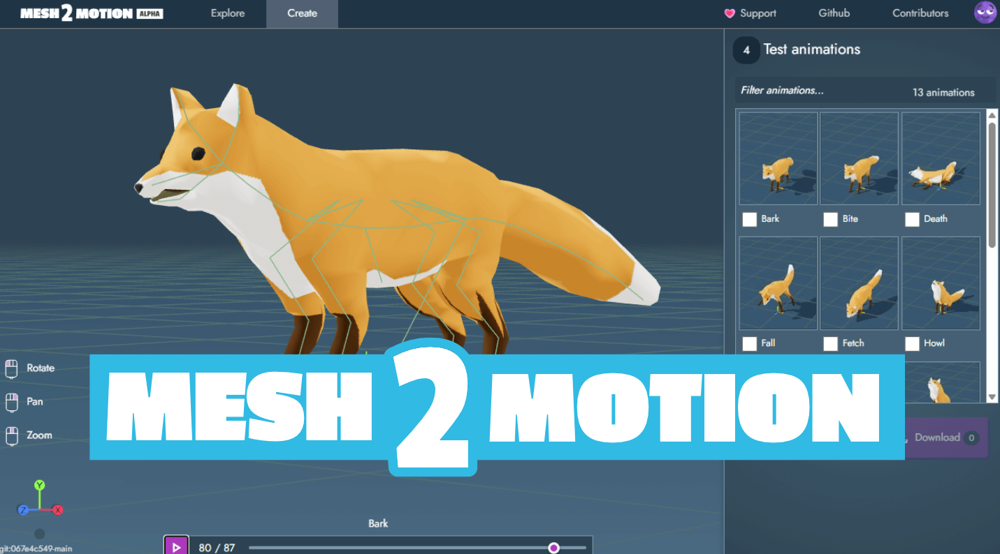

# Mesh2Motion

<table>
  <tr>
    <td><h4>Discord<h4></td>
    <td><a href="https://discord.com/channels/1408921718231273613/1452129660791165001">Join the Discord channel</a></td>
    <td>
      
    </td>
  </tr>
</table>

Mesh2Motion is a FREE, open-source web application that lets you animate 3D models with ease. You can import models in GLB, GLTF, DAE and FBX formats and export animations in the widely-supported GLB format.

Some key features of Mesh2Motion include the following:

✨ Human & Animal Rigs: Supports various skeleton options for humans and animals

✨ Intuitive Skeleton Positioning: Easy to position skeletons for animation

✨ Export Animations: Export multiple animations at once

✨ Open Source: Code is MIT license and art and animations are CC0

To keep this project modular, I broke apart different functions into different repositories listed here.
